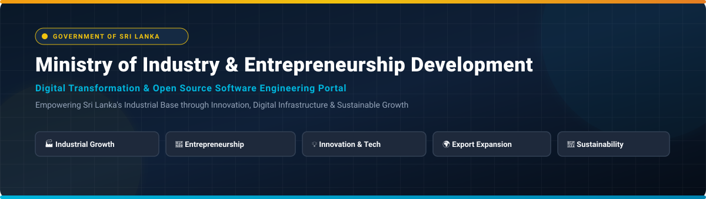

<p align="center">
  
</p>

<p align="center">
  <a href="https://www.industry.gov.lk/web/"></a>
  
  
  
</p>

<p align="center">
  <b>Official Technology &amp; Software Development Portal of the Ministry of Industry and Entrepreneurship Development</b><br>
  <i>Democratic Socialist Republic of Sri Lanka</i>
</p>

---

## 📌 Table of Contents

- [About the Ministry](#-about-the-ministry)
- [Vision & Mission](#-vision--mission)
- [Digital & Technology Initiatives](#-digital--technology-initiatives)
- [Strategic Focus Areas](#-strategic-focus-areas)
- [Engineering & Repository Standards](#-engineering--repository-standards)
- [Contribution & Governance Guidelines](#-contribution--governance-guidelines)
- [Official Information & Contact](#-official-information--contact)

---

## 🏛️ About the Ministry

The **Ministry of Industry and Entrepreneurship Development** is a premier Government institution of Sri Lanka dedicated to empowering the national industrial ecosystem, expanding enterprise development, fostering technological innovation, and building an enabling infrastructure for long-term, sustainable economic growth.

Through public-sector modernization and strategic industrial policy, the Ministry actively works to:
- **Strengthen** local manufacturing and high-value industrial sectors.
- **Support & Scale** micro, small, and medium enterprises (MSMEs) and tech entrepreneurs.
- **Attract & Expand** local and international industrial investment opportunities.
- **Drive Tech Adoption** towards export-oriented, high-tech, and sustainable industrial products.

---

## 🎯 Vision & Mission

> ### 👁️ Our Vision
> <blockquote align="center">
> <i>“Establish a Globally Competitive National Industry Base for Sustainable and Inclusive Growth of Sri Lanka.”</i>
> </blockquote>

> ### 🚀 Our Mission
> To encourage diversified, high-value-added and innovative industrial products, promote environmentally sustainable practices, expand market access, and advance industrial development through technology, knowledge, and innovative thinking.

---

## 💻 Digital & Technology Initiatives

This GitHub Organization serves as the centralized digital engineering and open-source collaboration ecosystem for technical projects led or supported by the Ministry.

```
                  ┌──────────────────────────────────────────────┐
                  │ Ministry of Industry & Entrepreneurship Dev  │
                  └──────────────────────┬───────────────────────┘
                                         │
       ┌──────────────────┬──────────────┴──────────────┬──────────────────┐
       ▼                  ▼                             ▼                  ▼
┌──────────────┐   ┌──────────────┐              ┌──────────────┐   ┌──────────────┐
│  Govt Info   │   │  Web & App   │              │ Data-Driven  │   │ Open Source  │
│  Systems     │   │ Development  │              │  Solutions   │   │ Collaboration│
└──────────────┘   └──────────────┘              └──────────────┘   └──────────────┘
```

### Scope of Projects Hosted Here:
| Initiative | Description & Purpose |
| :--- | :--- |
| **🌐 Digital Transformation** | Modernizing public sector industrial services, digitizing enterprise workflows, and automating licensing and permits. |
| **🏛️ Government Information Systems** | Robust, secure, and scalable backend platforms enabling efficient governance and data exchange across departments. |
| **📱 Web & Mobile Applications** | Public portals, investor dashboards, and entrepreneur support apps built for accessibility and user experience. |
| **📊 Data-Driven Solutions** | Analytics tools, industrial data dashboards, export performance tracking, and market intelligence platforms. |
| **🔬 Technical R&D** | Applied research projects exploring IoT, Smart Manufacturing, AI in industry, and blockchain supply chain verification. |
| **🤝 Open-Source & Civic Tech** | Collaborative software modules enabling civic developers, academics, and startups to build upon open government APIs. |
| **📑 Developer Documentation** | Standards, technical manuals, API specs, and integration guides for internal and third-party developers. |

---

## 🔑 Strategic Focus Areas

<table width="100%">
  <tr>
    <td width="50%" stroke="none" valign="top">
      <h3>🏭 1. Industrial Development</h3>
      <p>Supporting the growth, modernization, digital maturity, and global competitiveness of Sri Lanka’s national industrial base.</p>
    </td>
    <td width="50%" stroke="none" valign="top">
      <h3>🚀 2. Entrepreneurship Support</h3>
      <p>Creating vibrant incubator platforms, funding access tools, and digital advisory systems for start-ups and enterprise growth.</p>
    </td>
  </tr>
  <tr>
    <td width="50%" opacity="0.9" valign="top">
      <h3>💡 3. Innovation &amp; Technology</h3>
      <p>Encouraging state-of-the-art tech adoption, smart manufacturing processes, and knowledge-driven industrial transformation.</p>
    </td>
    <td width="50%" opacity="0.9" valign="top">
      <h3>🌍 4. Export &amp; Market Access</h3>
      <p>Supporting export-oriented production, international trade compliance, and digital tools for global market integration.</p>
    </td>
  </tr>
  <tr>
    <td colspan="2" align="center" opacity="0.9" valign="top">
      <h3>🌱 5. Sustainable Industrial Development</h3>
      <p>Promoting eco-friendly manufacturing, green energy integration, resource recycling, and environmentally conscious industrial growth.</p>
    </td>
  </tr>
</table>

---

## 🛠️ Engineering & Repository Standards

Projects maintained under this organization adhere strictly to institutional software engineering practices:

```
[ Security & Access ] ──> [ Clean Architecture ] ──> [ Continuous Integration ] ──> [ Automated Testing ]
```

* **🔐 Security & Access Control**: Strict role-based access management, credential scanning, secrets management, and adherence to National Cyber Security Standards.
* **🧩 Scalable Architecture**: Clean, modular, and maintainable system designs utilizing standardized containerized deployments and microservices where applicable.
* **📚 Comprehensive Documentation**: Every repository must feature complete setup instructions, API documentation, architecture diagrams, and inline code comments.
* **🔄 Structured Git Workflows**: Standardized branch naming (`feature/*`, `fix/*`, `release/*`), commit message conventions, and mandatory peer code reviews.
* **🧪 Quality Assurance**: Automated unit testing, integration tests, dynamic security scans, and code coverage requirements prior to production merge.
* **📈 Long-Term Maintainability**: Active dependency auditing, semantic versioning, and continuous maintenance schedules.

---

## 🤝 Contribution & Governance

Collaborative software development is vital to building transparent, resilient, and public-grade software solutions for Sri Lanka.

### Guidelines for Collaborators:
1. **Authorized Developers**: Access to private repositories is restricted to authorized ministry staff, contracted partners, and approved technical contributors.
2. **Public / Open Source Projects**: Community contributions via Pull Requests are welcomed on designated public repositories. Please follow the individual project's `CONTRIBUTING.md` guidelines.
3. **Reporting Vulnerabilities**: If you discover a security vulnerability within any repository, please report it responsibly by contacting **[info@industry.gov.lk](mailto:info@industry.gov.lk)** rather than opening a public issue.

---

## 📍 Official Information & Contact

<div align="center">

| Field | Official Details |
| :--- | :--- |
| **🏛️ Institution** | **Ministry of Industry and Entrepreneurship Development** |
| **📍 Address** | No. 73/1, Galle Road, Colombo 003, Sri Lanka |
| **🌐 Website** | [www.industry.gov.lk](https://www.industry.gov.lk/web/) |
| **✉️ General Inquiry Email** | [info@industry.gov.lk](mailto:info@industry.gov.lk) |

<br>

<a href="https://www.industry.gov.lk/web/">
  
</a>
<a href="mailto:info@industry.gov.lk">
  
</a>

</div>

---

<p align="center">
  <small>© 2026 Ministry of Industry and Entrepreneurship Development, Government of Sri Lanka. All Rights Reserved.</small>
</p>
